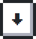
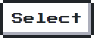

    

<h2 align="center">

</h2>

<h3 align="center"> I'm a programmer! </h3>

---

### Experience 📈

- 🔭 Have played around with:                    
- 🔧 Using the following tools:     
- 🌱 Currently learning:    

---

---

### 🎮 Let's play Pokémon together~
 

 
  
 
  

-----

Click buttons above to issue new gamepad input, refresh this page to view newst game screen.

